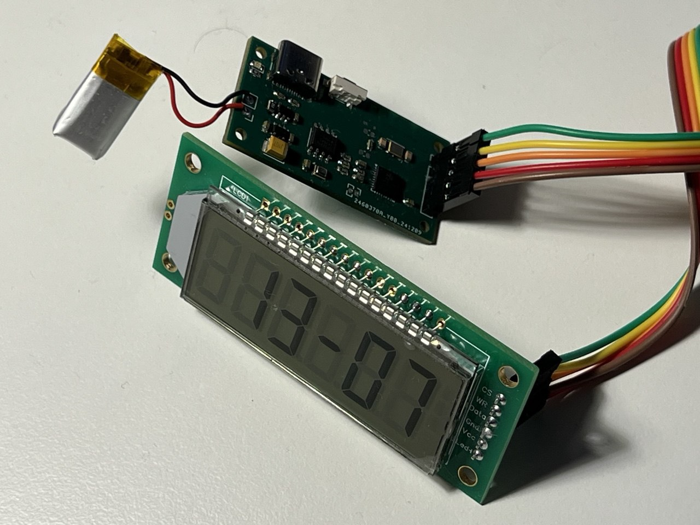
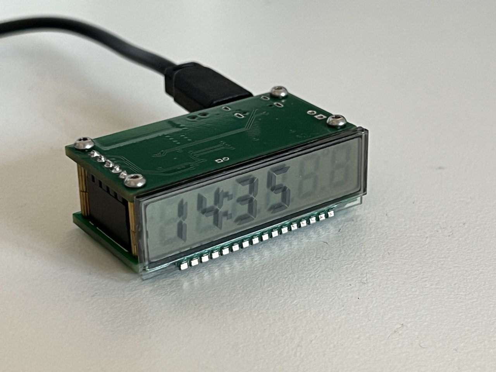

# HT1621Display Library

The HT1621Display library is a robust and flexible solution for controlling 7-segment displays based on the HT1621 driver IC. Designed with versatility and simplicity in mind, the library simplifies interfacing with various HT1621-based LCDs, allowing developers to focus on their applications instead of managing low-level details. Its modular and template-based architecture provides a unified approach for handling different display configurations, enabling both quick prototyping and advanced customization.





## Usage

1. **Include the Library**  
   Start by including the `HT1621Display.h` header file in your code.  
   ```cpp
   #include <HT1621Display.h>
   ```

2. **Define the Driver Class with Pin Definitions**  
   Specify the pins for `CS`, `WR`, and `DATA`, then define a driver class template.  
   ```cpp
   #define PIN_CS 4
   #define PIN_WR 5
   #define PIN_DATA 6

   typedef HT1621::Driver<PIN_CS, PIN_WR, PIN_DATA> DisplayDriver;
   ```

3. **Define the Display Class Using the Driver**  
   Create a display class using the driver class defined earlier.  
   ```cpp
   typedef LCD::Display<DisplayDriver> Display;
   ```

4. **Instantiate the Display Object**  
   Instantiate an object of the display class.  
   ```cpp
   Display htDisplay;
   ```

5. **Initialize the Display in the `setup` Function**  
   Use the `begin()` and `configure()` methods to initialize the display.  
   ```cpp
   void setup() {
       htDisplay.begin();
       htDisplay.configure();
   }
   ```

6. **Control the Display in the `loop` Function**  
   Use methods like `clearBuffer()`, `setDigit()`, and `sync()` to display values.  
   ```cpp
   void loop() {
       htDisplay.clearBuffer();
       htDisplay.setDigit(0, 1);  // Display "1" at the first digit
       htDisplay.sync();
   }
   ```

## Configuration

The configuration of this library is divided into three distinct parts to ensure flexibility and modularity. 

First, the HT1621 chip configuration defines the pins used for communication with the chip, such as Chip Select (CS), Write (WR), and Data (DATA). This allows you to easily map the pins to your microcontroller's GPIOs. 

Second, the LCD display configuration involves specifying the number of common pins, the segments of the display, and the corresponding bit masks that control the individual segments. These settings are essential for tailoring the display behavior to your specific hardware, whether it’s a 7-segment display or a more complex LCD. 

Lastly, the character mapper converts input data (such as digits or custom characters) into the corresponding segment images to be displayed on the screen. This part of the configuration is responsible for mapping characters or digits to their visual representations, ensuring that the display outputs the correct content. 

Together, these three configuration layers provide a flexible and easy-to-adapt structure for controlling a wide variety of HT1621-based displays.

### DefaultHardwareConfig

The `DefaultHardwareConfig` struct provides default configuration settings for the display hardware. You can override it in your code to work with different kinds of LCD displays.

* commons: The number of common pins (typically 2, 3, or 4).
* digits: The number of digits on the display.
* bias: The bias configuration (either 1/2 or 1/3 bias).
* SEG_*: Segment definitions for controlling individual segments of the display.

### CharacterMapper

The `CharacterMapper` class provides functions for mapping digits and characters to their corresponding segment data. You can extend this to support additional custom characters if needed.

## License

This library is licensed under the [MIT License](LICENSE).
